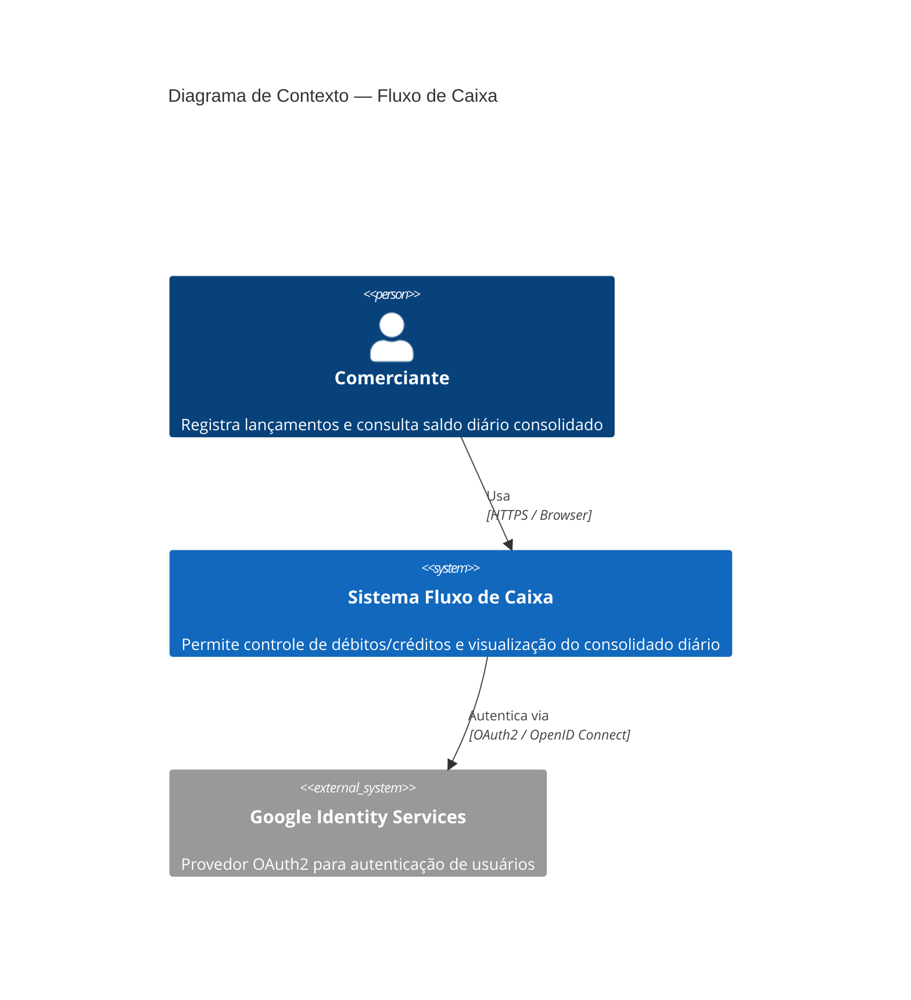
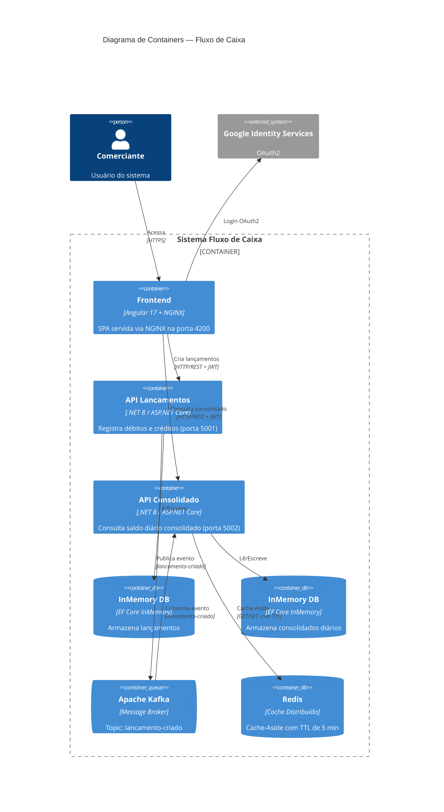
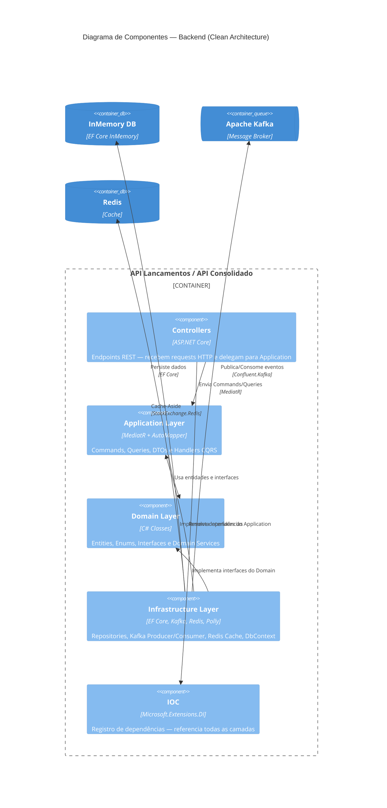

# Fluxo de Caixa — Cash Flow Management System

> Solução para o Desafio de Arquiteto de Software

## Visão Geral

Sistema de controle de fluxo de caixa para comerciantes, permitindo o registro de lançamentos (débitos e créditos) e a visualização do saldo diário consolidado.

### Arquitetura

Microserviços com Clean Architecture + CQRS + Event-Driven usando Apache Kafka.

#### C4 Level 1 — Contexto do Sistema

Visão geral do sistema e seus atores externos.



#### C4 Level 2 — Containers

Os 6 containers que compõem o sistema e suas interações.



#### C4 Level 3 — Componentes (Backend)

Camadas Clean Architecture dentro de cada microserviço.



Para detalhes completos da arquitetura, consulte [docs/ARCHITECTURE.md](docs/ARCHITECTURE.md).

---

## Requisitos

### Para Docker (recomendado)
- Docker Desktop 24+
- Docker Compose v2+

### Para execução local sem Docker
- .NET 8 SDK
- Node.js 20+
- Apache Kafka + Zookeeper (ou Docker apenas para infra)
- Redis 7+

---

## Execução Rápida (Docker)

```bash
# 1. Clone o repositório
git clone <repo-url>
cd desafio-arquiteto-software

# 2. Suba todos os serviços
docker-compose up -d

# 3. Aguarde os serviços ficarem saudáveis (~60 segundos)
docker-compose ps

# 4. Acesse a aplicação
# Frontend:        http://localhost:4200
# API Lancamentos: http://localhost:5001/swagger
# API Consolidado: http://localhost:5002/swagger
```

---

## Execução Local (sem Docker)

### 1. Infraestrutura (Kafka + Redis via Docker)

```bash
# Subir apenas a infraestrutura
docker-compose up -d zookeeper kafka redis
```

### 2. Backend — API Lancamentos

```bash
cd src/backend/FluxoCaixa.API.Lancamentos

# Restaurar pacotes e executar
dotnet restore
dotnet run

# Acesse: http://localhost:5001/swagger
```

### 3. Backend — API Consolidado

```bash
cd src/backend/FluxoCaixa.API.Consolidado

dotnet restore
dotnet run

# Acesse: http://localhost:5002/swagger
```

### 4. Frontend — Angular

```bash
cd src/frontend/fluxo-caixa-app

# Instalar dependências
npm install

# Iniciar em modo desenvolvimento
npm start

# Acesse: http://localhost:4200
```

---

## Executar Testes

### Testes Unitários

```bash
cd src/backend
dotnet test FluxoCaixa.Tests.Unit/ --logger "console;verbosity=detailed"
```

### Testes de Integração

```bash
cd src/backend
dotnet test FluxoCaixa.Tests.Integration/ --logger "console;verbosity=detailed"
```

### Testes Frontend (Angular)

```bash
cd src/frontend/fluxo-caixa-app
npm test
```

### Todos os testes

```bash
# Backend
cd src/backend
dotnet test

# Frontend
cd src/frontend/fluxo-caixa-app
npm test -- --watch=false
```

---

## Guia de Uso da API

### 1. Autenticação — Obter JWT Token

**POST** `http://localhost:5001/api/v1/auth/token`

```json
{
  "username": "admin",
  "password": "admin123"
}
```

Resposta:
```json
{
  "token": "eyJhbGciOiJIUzI1NiIsInR5cCI6IkpXVCJ9...",
  "expiration": "2024-01-01T01:00:00Z"
}
```

### 2. Criar Lançamento (Crédito)

**POST** `http://localhost:5001/api/v1/lancamentos`
Header: `Authorization: Bearer <token>`

```json
{
  "descricao": "Venda de produto",
  "valor": 150.00,
  "tipo": 1,
  "dataLancamento": "2024-01-15T10:00:00Z"
}
```

> `tipo`: 1 = Crédito, 2 = Débito

### 3. Criar Lançamento (Débito)

**POST** `http://localhost:5001/api/v1/lancamentos`
Header: `Authorization: Bearer <token>`

```json
{
  "descricao": "Compra de materiais",
  "valor": 75.50,
  "tipo": 2,
  "dataLancamento": "2024-01-15T14:00:00Z"
}
```

### 4. Listar Lançamentos

**GET** `http://localhost:5001/api/v1/lancamentos`
Header: `Authorization: Bearer <token>`

### 5. Consultar Consolidado do Dia

**GET** `http://localhost:5002/api/v1/consolidado`
Header: `Authorization: Bearer <token>`

Resposta:
```json
{
  "id": "...",
  "data": "2024-01-15",
  "totalCreditos": 150.00,
  "totalDebitos": 75.50,
  "saldo": 74.50,
  "updatedAt": "2024-01-15T14:05:00Z"
}
```

### 6. Consultar Consolidado por Data

**GET** `http://localhost:5002/api/v1/consolidado/2024-01-15`
Header: `Authorization: Bearer <token>`

---

## Estrutura do Projeto

```
desafio-arquiteto-software/
├── .gitignore
├── docker-compose.yml
├── README.md
├── DESAFIO-ARQUITETO-SOFTWARE.md
├── docs/
│   └── ARCHITECTURE.md          # Documentação completa da arquitetura
└── src/
    ├── backend/
    │   ├── FluxoCaixa.sln
    │   ├── FluxoCaixa.Domain/        # Camada de Domínio (Core)
    │   ├── FluxoCaixa.Application/   # Camada de Aplicação
    │   ├── FluxoCaixa.Infrastructure/ # Camada de Infraestrutura
    │   ├── FluxoCaixa.IOC/           # Injeção de Dependência
    │   ├── FluxoCaixa.API.Lancamentos/   # Serviço de Lançamentos
    │   ├── FluxoCaixa.API.Consolidado/   # Serviço Consolidado
    │   ├── FluxoCaixa.Tests.Unit/        # Testes Unitários
    │   └── FluxoCaixa.Tests.Integration/ # Testes de Integração
    └── frontend/
        ├── Dockerfile
        ├── nginx.conf
        └── fluxo-caixa-app/         # Aplicação Angular
```

---

## Variáveis de Ambiente

### API Lancamentos / API Consolidado

| Variável | Padrão | Descrição |
|---|---|---|
| `Jwt__Key` | `SuperSecretKey...` | Chave secreta JWT |
| `Jwt__Issuer` | `FluxoCaixa.API.*` | Issuer do token |
| `Jwt__Audience` | `FluxoCaixa.Clients` | Audience do token |
| `Kafka__BootstrapServers` | `localhost:9092` | Endereço Kafka |
| `Redis__ConnectionString` | `localhost:6379` | Conexão Redis |
| `Redis__CacheTtlMinutes` | `5` | TTL do cache em minutos |

### Frontend (environment.ts)

| Variável | Padrão | Descrição |
|---|---|---|
| `apiLancamentosUrl` | `http://localhost:5001` | URL API Lançamentos |
| `apiConsolidadoUrl` | `http://localhost:5002` | URL API Consolidado |
| `googleClientId` | `YOUR_GOOGLE_CLIENT_ID` | Client ID OAuth2 Google |

---

## Tecnologias Utilizadas

### Backend
- **.NET 8** — Runtime
- **ASP.NET Core 8** — Web API
- **Entity Framework Core 8 (InMemory)** — ORM
- **MediatR 12** — CQRS + Mediator
- **AutoMapper 12** — Mapeamento de objetos
- **Confluent.Kafka 2.3** — Cliente Kafka
- **StackExchange.Redis 2.7** — Cliente Redis
- **Polly 8** — Circuit Breaker e Retry
- **JWT Bearer** — Autenticação
- **Serilog** — Logging estruturado
- **Swagger/OpenAPI** — Documentação da API
- **xUnit + Moq + FluentAssertions** — Testes

### Frontend
- **Angular 17** — Framework SPA
- **TypeScript 5.4** — Linguagem
- **Google Identity Services** — OAuth2
- **RxJS 7.8** — Programação reativa
- **Jasmine + Karma** — Testes unitários

### Infraestrutura
- **Apache Kafka + Zookeeper** — Message broker
- **Redis** — Cache distribuído
- **Docker + Docker Compose** — Containerização
- **NGINX** — Servidor web (frontend)

---

## Padrões e Boas Práticas

- **Clean Architecture** — Separação por camadas com regra de dependência
- **CQRS** — Separação de comandos (escrita) e queries (leitura)
- **Event-Driven Architecture** — Kafka para comunicação assíncrona
- **SOLID Principles** — SRP, OCP, LSP, ISP, DIP
- **Repository Pattern** — Abstração de acesso a dados
- **Domain-Driven Design** — Entidades ricas, domain services
- **Circuit Breaker** — Polly para tolerância a falhas
- **Cache-Aside Pattern** — Redis com TTL para consolidado

---

## Requisitos Não-Funcionais Atendidos

| Requisito | Solução |
|---|---|
| Lancamentos não para se Consolidado cair | Kafka async — Lancamentos publica evento independentemente |
| 50 req/s no Consolidado com < 5% perda | Redis cache + TTL 5min + Polly retry |
| Alta disponibilidade | Stateless APIs + Circuit Breaker |
| Segurança | JWT + HTTPS (prod) + OAuth2 |

---

## Pontos de Melhoria Futura

1. **Banco Persistente**: Substituir InMemory por PostgreSQL com migrations reais
2. **Event Sourcing**: Armazenar todos os eventos de Lancamento para auditoria completa
3. **Distributed Tracing**: OpenTelemetry + Jaeger para observabilidade
4. **API Gateway**: Kong/NGINX como ponto único de entrada com rate limiting
5. **Kubernetes**: Deploy com K8s + HPA para auto-scaling horizontal
6. **WebSockets**: Dashboard em tempo real via SignalR
7. **Multi-tenancy**: Suporte a múltiplos comerciantes com isolamento de dados
8. **Saga Pattern**: Gerenciamento de transações distribuídas
9. **CQRS Read Store**: Banco de dados de leitura otimizado separado do de escrita
10. **Refresh Tokens**: Renovação automática de JWT sem re-login

---

## Contribuição

Este projeto foi desenvolvido como resposta ao desafio técnico de Arquiteto de Software, utilizando uma abordagem multi-agente:
- **Agente Arquiteto**: Design da solução, ADRs, documentação
- **Agente Backend**: Implementação C# (Clean Architecture, CQRS, Kafka, Redis)
- **Agente Frontend**: Implementação Angular (OAuth2, serviços, testes)
